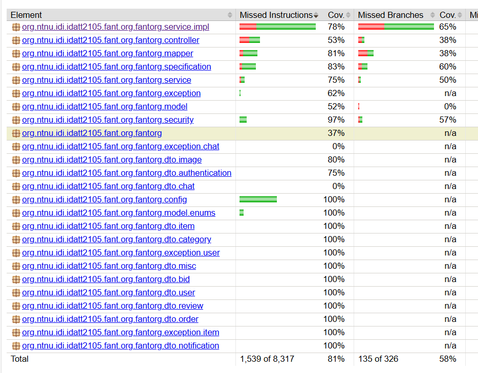

<h1 align="center">
            ShopIT
</h1>
ShopIT is an application designed for gathering sellers and buyers into a common marketplace. Use ShopIT to explore what other people around Norway are selling, or find buyers for your niche merchandise. This repository serves as the server for the application.

## 🚀 Getting started
### Requirements
To run the server, you need the following installed:
- Java 21
- Maven
- Docker

### ⚙ Setup
#### The following setup is mandatory for running the server.
To run the project you need to have an `application-secret.yml` file to store all the secret keys, credentials and config properties.
Some of the properties are API-keys used to f.ex use cloud image services or retrieve postal information and thereby must be kept secret for security reasons.

However, the ZIP file containing the project files should already contain this file.


### 🚗 Running the server
1. Clone the repository
```
git clone git@github.com:tinit03/fullstack_backend.git
```
If you don't have SSH keys use: 
``` 
git clone https://github.com/tinit03/fullstack_backend.git
```
2. Navigate to the project root folder
```
cd fullstack_backend
```
3. Build the server image (OBS: Make sure docker is running). This step will take some time.
```
docker build -t <image-name>:latest .
```
4. Run the server (OBS: Make sure docker is running).
```
docker run -rm <image-name>:latest -p 8080:8080
```
Example: 
``` 
docker build -t myapp:latest .
docker run -rm myapp:latest -p 8080:8080
```
The server is now running on port 8080.

##### Exiting the application

To exit the application, use CTRL+C.

### 🧪 Test data
The database is populated with three pre-configured users. You can log in with the following credentials:

**User 1**
- Email: ```test@fant.org```
- Password: ```password```

**User 2**
- Username: ```JohnDoe@mail.com```
- Password: ```password```

**User 3**
- Username: ```alicesmith@mail.com```
- Password: ```password```
### 📋 Running tests
You can run unit and integration tests with:
```
mvn verify
```
This will generate a ```target``` folder with test coverage data. You can now find the report
by navigating the folder structure: ```target -> site -> jacoco -> index.html```.

This will open a page similar to this:



To only run unit tests run:

```
mvn test
```
### Accessing the database
To log into the database, paste this URL into your browser
```
localhost:8080/h2-console
```
Change the ```JDBC URL``` field to
``` 
jdbc:h2:mem:testdb
```
Credentials:
```
- Username: sa
- Password:  
(no password)
```

### 🗎 Documentation
#### REST endpoints
The REST endpoints are documented using [Swagger UI](https://swagger.io/tools/swagger-ui/). The documentation is generated at runtime and can be found [here](http://localhost:8080/swagger-ui/index.html) while the application is running.

#### Source code
The entire backend source code has been documented with Javadoc.